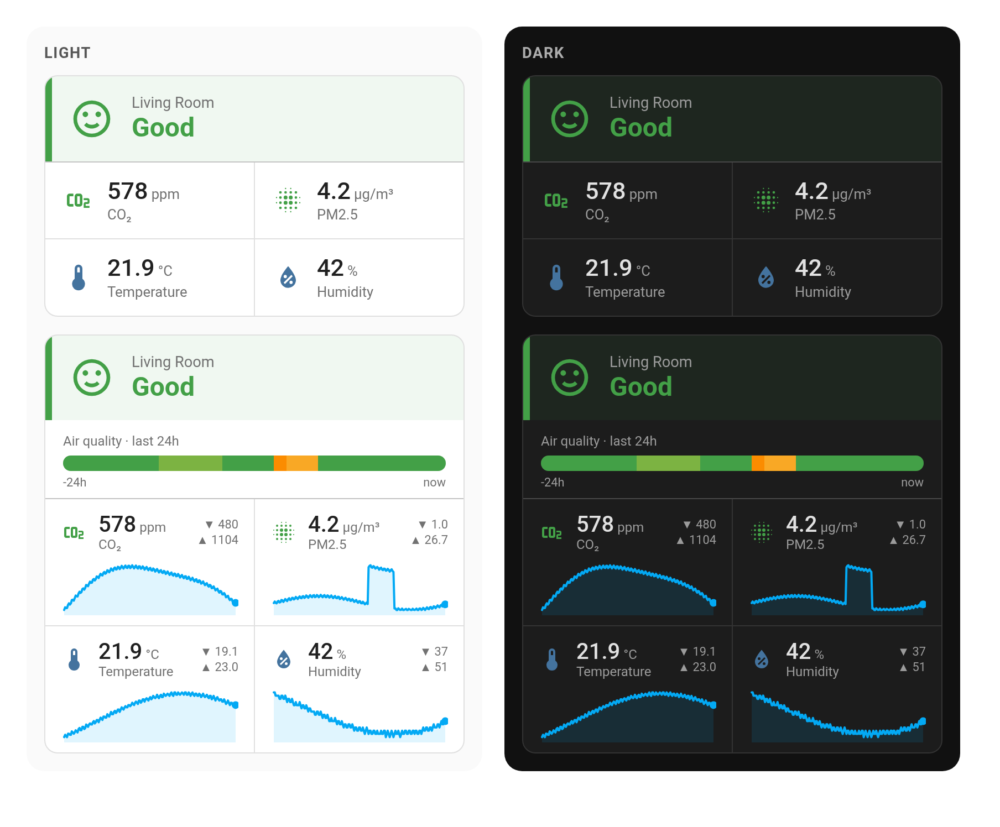
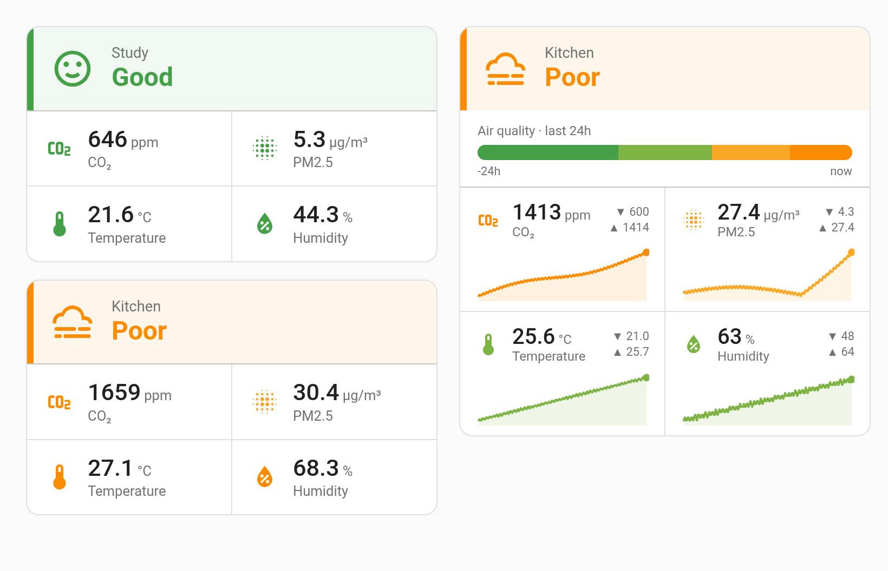

<div align="center">

# IKEA ALPSTUGA Air Quality Cards

Custom [Home Assistant](https://www.home-assistant.io/) Lovelace cards that
visualize **every metric** the IKEA **ALPSTUGA** (Matter air quality sensor,
E2495) exposes — Air Quality, CO₂, PM2.5, temperature and humidity — in one card,
with an optional 24-hour history variant.

[![HACS Custom][hacs-badge]][hacs]
[![GitHub release][release-badge]][releases]
[![License: MIT][license-badge]][license]
[![Made for Home Assistant][hass-badge]][hass]



</div>

## Contents

- [Features](#features)
- [Installation](#installation)
- [Configuration](#configuration)
- [How auto-detection works](#how-auto-detection-works)
- [Color thresholds](#color-thresholds)
- [Development](#development)
- [Credits](#credits)

## Features

Two cards ship in this repository — install once, use either (or both):

| Card | What it shows |
| ---- | ------------- |
| **`alpstuga-card`** | Current value of every metric in a compact tile layout. |
| **`alpstuga-card-advanced`** | The same, plus 24h history: an air-quality timeline strip and per-metric sparklines with hover tooltips. |

Both cards:

- **Auto-detect** all ALPSTUGA entities from a single `device` id (with optional
  per-entity overrides).
- Show a **color-coded Air Quality banner** (`good` → `extremely_poor`).
- **Tint every metric by published guidelines** — CO₂, PM2.5, temperature and
  humidity tiles (and the advanced card's sparklines) are colored by their
  level. Toggle with `guidelines: none`. See [Color thresholds](#color-thresholds).
- Are **theme-aware** (light/dark) and open the entity's more-info dialog on click.
- Ship a **graphical config editor** and register in the card picker.

| Metric        | Unit    | Notes                                                     |
| ------------- | ------- | --------------------------------------------------------- |
| Air Quality   | –       | `good` → `extremely_poor`, shown as a color-coded banner |
| CO₂           | ppm     | tinted by air-quality level (WHO/UBA)                     |
| PM2.5         | µg/m³   | tinted by air-quality level (WHO)                         |
| Temperature   | °C / °F | tinted by comfort band (WHO/ASHRAE)                       |
| Humidity      | %       | tinted by comfort band (ASHRAE/EPA)                       |

> The ALPSTUGA has **no VOC sensor** (unlike the older VINDSTYRKA), so tVOC is not shown.

<div align="center">



<sub>Guideline coloring: a fresh room (green) vs a stuffy one, and the advanced card's per-metric tinted sparklines.</sub>

</div>

## Installation

### HACS (recommended)

[![Open your Home Assistant instance and open this repository inside the Home Assistant Community Store.][my-hacs-badge]][my-hacs]

Click the button above, or add it manually:

1. HACS → **⋮** → **Custom repositories**.
2. Add `https://github.com/oltdaniel/hass-ikea-alpstuga-cards` with type **Dashboard**.
3. Install **IKEA ALPSTUGA Air Quality Cards**.
4. HACS registers the resource automatically. Hard-reload your browser (Ctrl/Cmd-Shift-R).

Both `custom:alpstuga-card` and `custom:alpstuga-card-advanced` are registered via the
single `index.js` entry file, so **no manual resource is needed**.

### Manual

1. Copy all five JS files (`index.js`, `alpstuga-card.js`,
   `alpstuga-card-advanced.js`, `translations.js`, `guidelines.js`) into
   `config/www/` — keep them side by side, as `index.js` imports the two cards
   and each card imports `translations.js` and `guidelines.js`.
2. Add **one** dashboard resource — **Settings → Dashboards → ⋮ → Resources → Add**:
   - URL: `/local/index.js`
   - Type: **JavaScript Module**
3. Hard-reload your browser.

> Only want one card? Add just that file (`/local/alpstuga-card.js` or
> `/local/alpstuga-card-advanced.js`) as the resource instead — but keep
> `translations.js` and `guidelines.js` alongside it, as each card imports them.

## Configuration

### Via the UI

Add a card → search **ALPSTUGA** → pick a card. In the visual editor, choose your
ALPSTUGA device; the entities are detected automatically.

### Via YAML

Simplest — auto-detect all entities from the device:

```yaml
type: custom:alpstuga-card
device: 1a2b3c4d5e6f...        # the ALPSTUGA device id
title: Living Room             # optional; defaults to the device name
```

The advanced card adds a `hours` history window:

```yaml
type: custom:alpstuga-card-advanced
device: 1a2b3c4d5e6f...
title: Living Room
hours: 24                      # optional history window, 1–168 (default 24)
guidelines: who                # optional color source; `none` to disable (default who)
```

Explicit entity overrides work on either card (any subset; overrides win over
auto-detection). You can also skip `device` entirely and configure everything here:

```yaml
type: custom:alpstuga-card
entities:
  air_quality: sensor.alpstuga_air_quality
  co2: sensor.alpstuga_carbon_dioxide
  pm25: sensor.alpstuga_pm2_5
  temperature: sensor.alpstuga_temperature
  humidity: sensor.alpstuga_humidity
```

### Options

| Option     | Type   | Required                   | Applies to | Description                                                    |
| ---------- | ------ | -------------------------- | ---------- | ------------------------------------------------------------- |
| `device`   | string | one of `device`/`entities` | both       | ALPSTUGA device id; auto-detects all entities by device_class. |
| `title`    | string | no                         | both       | Header text. Defaults to the device name.                      |
| `entities` | map    | one of `device`/`entities` | both       | Per-metric entity_id overrides: `air_quality`, `co2`, `pm25`, `temperature`, `humidity`. |
| `hours`    | number | no                         | advanced   | History window in hours (1–168, default 24).                   |
| `guidelines` | string | no                       | both       | Color source for tiles/charts: `who` (default) or `none` to disable tinting. |

> **Finding the device id:** Settings → Devices → your ALPSTUGA → the id is the last
> path segment of the URL (`/config/devices/device/<device_id>`).

> **Advanced card & history:** charts use Home Assistant's `history_during_period` and
> refresh every 5 min. An empty chart usually means the entity is excluded from the
> `recorder`, or not enough time has passed to accumulate data.

## How auto-detection works

Given a `device`, the cards walk the entity registry for entities on that device and
classify each by its `device_class`:

- `carbon_dioxide` → CO₂
- `pm25` → PM2.5
- `temperature` → Temperature
- `humidity` → Humidity
- an `enum` sensor whose state is one of the air-quality levels → Air Quality

Disabled and hidden entities are skipped. Any metric you set in `entities` overrides
the detected one.

## Color thresholds

The AQI banner uses the device's reported air-quality state. Every other metric
(tiles, and the sparklines on the advanced card) is tinted by the `guidelines`
profile — `who` by default, or `none` to switch tinting off. Thresholds come from
published guidelines, not taste:

**Pollutants** (monotonic — higher is worse):

| Level     | CO₂ (ppm) | PM2.5 (µg/m³) |
| --------- | --------- | ------------- |
| good      | < 800     | < 15          |
| fair      | < 1000    | < 25          |
| moderate  | < 1400    | < 37.5        |
| poor      | < 2000    | < 50          |
| very poor | ≥ 2000    | ≥ 50          |

**Comfort** (bidirectional — too low *and* too high are bad):

| Level     | Temperature (°C) | Humidity (% RH) |
| --------- | ---------------- | --------------- |
| good      | 18–24            | 30–60           |
| fair      | 16–26            | 25–65           |
| poor      | 12–30            | 20–70           |
| very poor | < 12 or > 30     | < 20 or > 70    |

Sources: PM2.5 — [WHO 2021 Global Air Quality Guidelines][who-aqg] (24-hour AQG +
interim targets); CO₂ — German [UBA / Umweltbundesamt][uba-co2] indoor guide
values (WHO sets no indoor CO₂ limit); Temperature — [WHO Housing & Health
Guidelines][who-housing] comfort band, aligned with ASHRAE 55; Humidity —
ASHRAE 55 / EPA healthy indoor range.

New standards can be added as named profiles in `guidelines.js` without touching
the cards.

[who-aqg]: https://www.who.int/news-room/questions-and-answers/item/who-global-air-quality-guidelines
[uba-co2]: https://pubmed.ncbi.nlm.nih.gov/19043767/
[who-housing]: https://www.who.int/publications/i/item/9789241550376

## Development

Two demo pages render the real card files against mock `hass` data — no Home
Assistant required:

- `demo/index.html` → **`preview.png`**, both cards in light and dark (the header).
- `demo/features.html` → **`features.png`**, the guideline coloring across a
  fresh vs stuffy room and the advanced card's tinted sparklines.

Shared HA stubs and mock-data helpers live in `demo/harness.js`; the pages stub
only the two HA elements the cards use (`ha-card`, `ha-icon`). For authenticity
the stubs pull real assets from a CDN: MDI icon paths from
[`@mdi/js`](https://www.npmjs.com/package/@mdi/js) (resolved by name, so nothing
to maintain) and Roboto from Google Fonts. **An internet connection is needed
when opening the demo.**

```bash
# Regenerate demo/preview.png + demo/features.png (needs python3 + Chromium/Chrome + internet):
./demo/screenshot.sh

# Or open interactively (module imports need a server, not file://):
python3 -m http.server 8899   # then browse to http://localhost:8899/demo/
```

## Credits

- Sensor hardware: [IKEA ALPSTUGA](https://www.ikea.com/de/de/p/alpstuga-luftqualitaetssensor-smart-50604187/) (Sensirion sensor module, Matter/Thread).
- Icons: [Material Design Icons](https://pictogrammers.com/library/mdi/) via `@mdi/js`.
- Built for [Home Assistant](https://www.home-assistant.io/) + [HACS](https://hacs.xyz/).

## License

[MIT](./LICENSE) © Daniel Oltmanns

<!-- Badges -->
[hacs]: https://github.com/hacs/integration
[hacs-badge]: https://img.shields.io/badge/HACS-Custom-41BDF5.svg?style=for-the-badge
[releases]: https://github.com/oltdaniel/hass-ikea-alpstuga-cards/releases
[release-badge]: https://img.shields.io/github/v/release/oltdaniel/hass-ikea-alpstuga-cards?style=for-the-badge
[license]: ./LICENSE
[license-badge]: https://img.shields.io/github/license/oltdaniel/hass-ikea-alpstuga-cards?style=for-the-badge
[hass]: https://www.home-assistant.io/
[hass-badge]: https://img.shields.io/badge/Made%20for-Home%20Assistant-18BCF2?style=for-the-badge&logo=home-assistant&logoColor=white
[my-hacs]: https://my.home-assistant.io/redirect/hacs_repository/?owner=oltdaniel&repository=hass-ikea-alpstuga-cards&category=plugin
[my-hacs-badge]: https://my.home-assistant.io/badges/hacs_repository.svg
